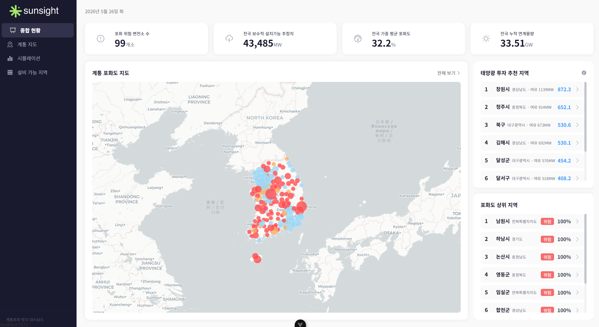
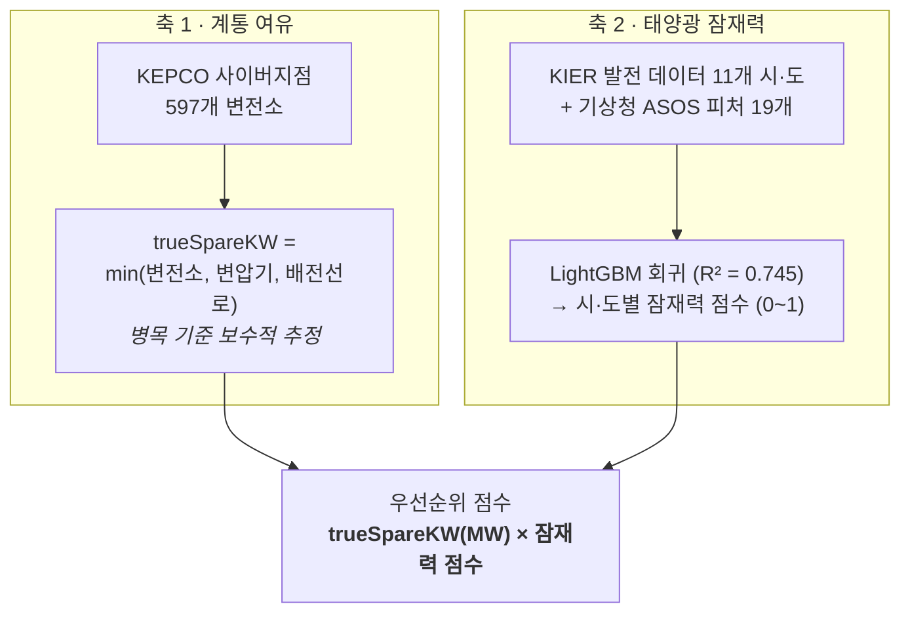
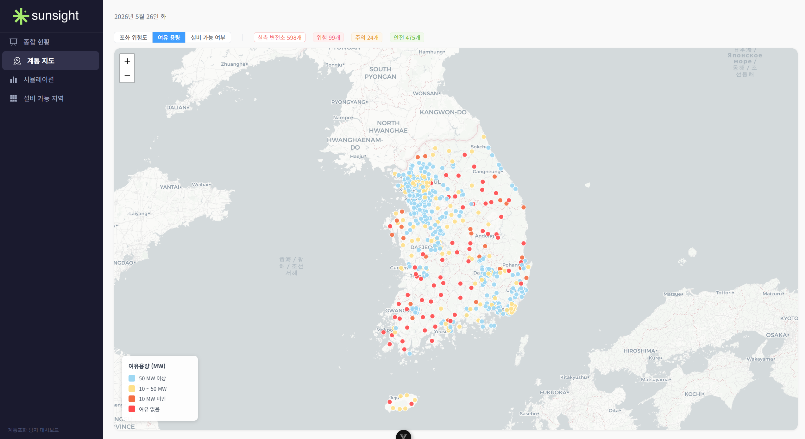
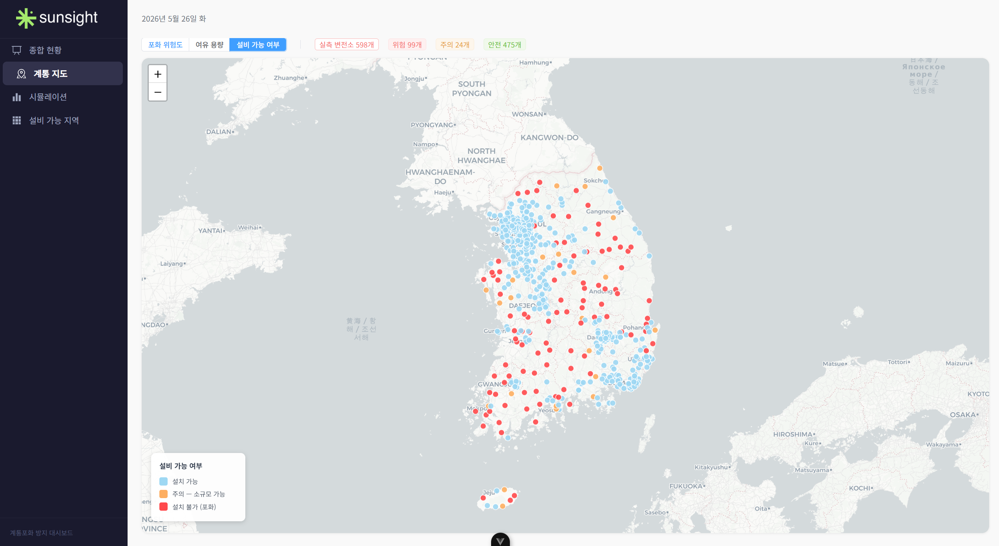
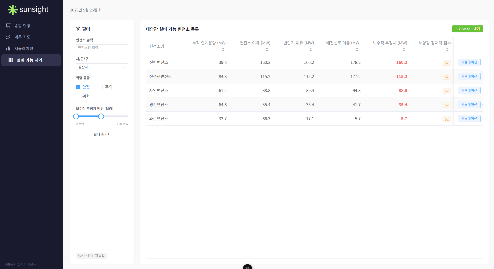
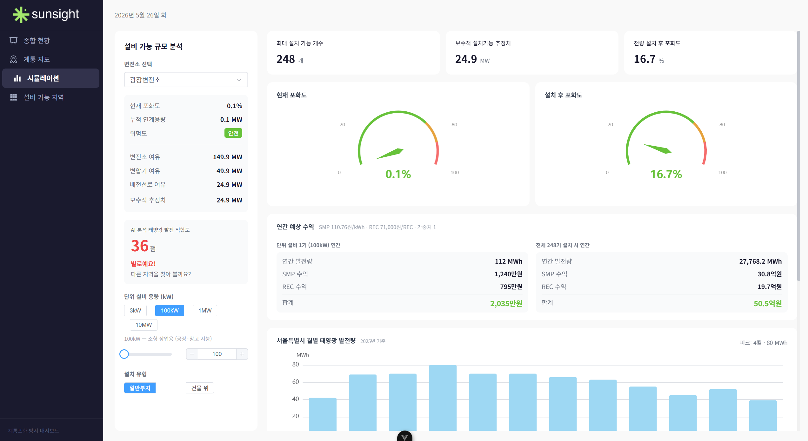
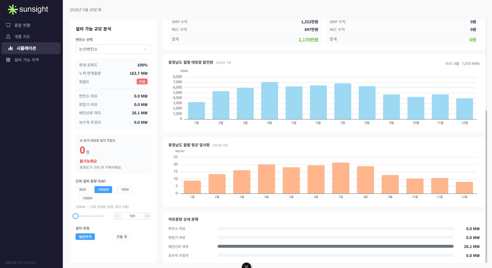

# SunSight

> **계통포화를 피해 태양광을 지을 곳을 찾아주는 의사결정 대시보드**
> 전국 597개 변전소의 계통 여유용량과 LightGBM 기반 지역별 태양광 잠재력을 결합해 설치 우선순위를 산출합니다.

**🏆 2026 영남대학교 SW-HUSS-COSS 공동 AI 융합 해커톤 장려상**



---

## 1. 프로젝트 개요

### 풀고자 한 문제

태양광 설비는 계속 늘어나는데, **전기를 받아줄 계통(변전소)의 여유는 지역마다 크게 다릅니다.**

- 여유 없는 변전소에 지으면 → **계통포화**로 출력제한(curtailment) 발생
- 일사량 낮은 지역에 지으면 → 계통에 여유가 있어도 **수익성 미달**

즉 "**지을 수 있는가(계통)**"와 "**지을 만한가(발전량)**"는 서로 다른 질문인데,
공개된 도구들은 대부분 둘 중 하나만 보여줍니다. SunSight는 두 축을 하나의 점수로 합칩니다.

### 해결 방식 — 두 축의 결합



**핵심 설계 판단**: 계통 여유용량은 변전소·주변압기·배전선로 세 값 중 **가장 작은 값(병목)** 을 채택했습니다.
평균이나 최댓값을 쓰면 실제로는 들어갈 수 없는 용량을 "가능"으로 표시하게 되고,
의사결정 지원 도구에서 과대추정은 곧 오판이기 때문입니다.

### 사용한 데이터

| 출처 | 항목 | 규모 | 용도 |
|---|---|---|---|
| **KEPCO 사이버지점** | 변전소·변압기·배전선로 여유용량, 누적 연계용량 | 597개 변전소 | 계통 여유(`trueSpareKW`) 산출 |
| **KIER 국가핵심데이터 API** | 시간별 GHI·누적일사량·단위용량당 발전량(pvAmt) | 11개 지점 × 8,760h (유효 7,474행) | LightGBM 학습 목표변수·피처 |
| **기상청 ASOS Open API** | 기온·강수·풍속·습도·기압·일조·일사량(icsr) 등 11종 | 학습 11개 시·도(2021) / 예측 17개 시·도(2025) | 모델 입력 피처 |
| **전력거래소 EPSIS** | 시·도별 연간 태양광 발전량 | 2017~2025년 | 월별 발전 패턴·성장률 시각화 |
| **에너지공단 / 전력거래소** | REC 71,000원/REC, SMP 110.76원/kWh | 2025년 기준 | 연간 예상 수익 산출 |

---

## 2. 주요 기능

### 종합 현황 대시보드 (`/`)


- 전국 KPI 집계 — 총 설치가능 여유용량(MW), 누적 연계용량(GW), 전국 평균 포화도
- 포화 위험 변전소 랭킹 — 포화도 85% 이상 위험 구간 우선 노출
- 시·군·구 단위로 집계한 미니맵, 클릭 시 해당 좌표로 계통 지도 이동

### 계통 지도 (`/grid-map`)

| 포화 위험도 | 여유 용량 | 설비 가능 여부 |
|---|---|---|
|  |  |  |

- Leaflet 기반 전국 지도에 **3종 레이어 토글** — 포화 위험도 / 여유 용량 / 설비 가능 여부
- 포화도 3단계 색상 구분 — 안전(<70%) · 주의(70~85%) · 위험(≥85%)
- 변전소 마커 클릭 → 사이드 패널에서 세부 여유용량 확인, 곧바로 시뮬레이션으로 이동

### 설비 가능 지역 (`/feasibility`)



- 변전소명 검색 · 시·군·구 · 위험도 · 여유용량 레인지의 **다중 조건 필터**
- `trueSpareKW(MW) × 잠재력 점수` 로 계산한 **우선순위 점수 기준 정렬**
- 행 클릭 시 해당 변전소를 시뮬레이션 화면으로 전달

### 설치 시뮬레이션 (`/simulation`)

| 설치 규모·포화도 시뮬레이션 | 연간 예상 수익 |
|---|---|
|  |  |

- 단위 용량 프리셋 선택 — 3kW(가정용) · 100kW(공장 지붕) · 1MW(영농형) · 10MW(발전단지)
- **설치 가능 기수** 자동 산출 + **설치 전/후 포화도 게이지 비교**
- 지역별 월별 발전 패턴 차트 (EPSIS 실적 기반)
- **연간 예상 수익** — SMP 110.76원/kWh + REC 71,000원/REC에
  설치 유형(일반부지·건물)과 용량 구간별 REC 가중치(0.8 ~ 1.5)를 자동 적용

---

## 3. 기술 스택

### 프론트엔드

| 분류 | 사용 기술 |
|---|---|
| 프레임워크 | Vue 3.5 (Composition API, `<script setup>`) · TypeScript 6 |
| 빌드 | Vite 8 |
| 상태 관리 | Pinia 3 (`substationStore` — 파생 상태를 전부 `computed`로 관리) |
| 라우팅 | Vue Router 5 (4개 라우트 전부 lazy import) |
| UI | Element Plus 2 |
| 지도 | Leaflet 1.9 + `@vue-leaflet/vue-leaflet` |
| 차트 | ECharts 6 + `vue-echarts` (게이지·라인·바) |

### 데이터 · ML 파이프라인

| 분류 | 사용 기술 |
|---|---|
| 모델 | **LightGBM** 회귀 — 기상 피처 19개로 단위용량당 발전량(pvAmt) 예측, R² 0.745 |
| 데이터 처리 | Python · pandas · scikit-learn (R²·Spearman 검증) |
| 수집 | 공공데이터포털 Open API — KIER 태양광 발전량, 기상청 ASOS 시간자료 |
| 전처리 | Node 스크립트 `scripts/build*.mjs` — Python 산출물을 프런트엔드용 JSON 스냅샷으로 변환 |

> **아키텍처 판단 — 런타임 API 호출 없이 빌드 타임 정적 스냅샷 생성**
> 원본 데이터가 월 1회 갱신 주기라, 실시간 API 연동은 외부 장애 리스크만 늘리고 얻는 게 없다고 판단했습니다.
> 수집·학습은 오프라인 Python 파이프라인이 처리하고, 앱은 생성된 JSON만 읽습니다.

### 개발 도구

ESLint 10 + oxlint · Prettier · vue-tsc(타입 체크) · Vitest 4 · Playwright

### 프로젝트 구조

데이터가 흐르는 순서대로 세 개의 층으로 나뉩니다 —
**① 수집·학습(Python)** → **② 스냅샷 변환(Node)** → **③ 화면(Vue)**.

```
sunsight/
│
├── ml/                                 # ① 데이터 수집 · 모델 학습 (Python)
│   ├── download_nationwide_asos.py     #    전국 17개 시·도 ASOS 수집
│   ├── check_icsr_ghi.py               #    icsr→ghi 선형관계 검증 (r=0.95)
│   ├── train_model.py                  #    ★ LightGBM 학습 (피처 19개)
│   ├── validate_model.py / check_r2.py #    성능 검증 (R² · Spearman)
│   ├── predict_nationwide.py           #    ★ 17개 시·도 잠재력 점수 예측
│   ├── visualize_*.py                  #    학습 결과 · 검증 시각화
│   ├── trained_model.pkl               #    학습된 모델 (R² 0.745)
│   ├── data/                           #    ASOS 원본 CSV (68MB · gitignore)
│   └── README.md                       #    모델 상세 · 데이터 출처
│
├── scripts/                            # ② 프론트엔드용 JSON 스냅샷 생성 (Node)
│   ├── buildSolarEfficiency.mjs        #    시·도별 잠재력 점수 → solarEfficiency.json
│   ├── buildSolarPattern.mjs           #    월별 발전 패턴   → solarPattern.json
│   ├── buildSolarTrend.mjs             #    연도별 발전량 추이 → solarTrend.json
│   └── collect_kier_nationwide.py      #    KIER 전국 발전량 수집
│
├── src/                                # ③ 대시보드 (Vue 3 + TypeScript)
│   ├── views/                          #    라우트 단위 페이지 4개
│   │   ├── DashboardView.vue           #      / — 종합 현황 + 미니맵
│   │   ├── GridMapView.vue             #      /grid-map — 계통 지도 (레이어 3종)
│   │   ├── FeasibilityView.vue         #      /feasibility — 필터 테이블 + 우선순위
│   │   └── SimulationView.vue          #      /simulation — 시뮬레이션 + 수익 계산
│   ├── components/
│   │   ├── map/                        #      GridMap · MapLegend (Leaflet)
│   │   ├── ui/                         #      KpiCard · RiskBadge
│   │   └── layout/                     #      AppHeader · AppSidebar
│   ├── stores/substationStore.ts       #    Pinia — 변전소 데이터 · 포화도 분류
│   ├── data/                           #    ②에서 생성된 JSON 스냅샷
│   │   ├── solarEfficiency.json        #      시·도별 잠재력 점수
│   │   ├── solarPattern.json           #      월별 발전 패턴
│   │   ├── solarTrend.json             #      연도별 발전량 추이
│   │   └── substationCoords.json       #      변전소 597개 (gitignore — 비공개)
│   ├── types/grid.ts                   #    공용 타입 정의
│   ├── router/index.ts                 #    라우트 4개 (lazy import)
│   ├── assets/                         #    전역 CSS · 로고
│   ├── App.vue
│   └── main.ts
│
├── docs/screenshots/                   # README용 화면 캡처
├── public/                             # 정적 자산 (favicon)
├── index.html                          # Vite 진입점
├── vite.config.ts                      # 빌드 설정
├── tsconfig*.json                      # TypeScript 설정 (app / node / vitest)
├── eslint.config.ts                    # 린트 규칙
└── package.json
```

★ 표시는 파이프라인의 핵심 스크립트입니다.
`train_model.py` → `predict_nationwide.py` → `buildSolarEfficiency.mjs` 순서로 실행하면
학습된 모델의 예측 결과가 대시보드 화면까지 연결됩니다.

---

## 4. 성과 및 배운 점

### ① 모델 일반화 실패 → 전국 재학습으로 R² 0.4 → 0.745

가장 오래 붙잡은 문제였습니다. 처음엔 대전 단일 지점 데이터로 학습했는데,
지역별 점수를 뽑아보니 **어느 지역을 넣어도 비슷한 값**이 나왔습니다.

원인은 단순했습니다. 단일 지점 학습에서는 **위도·경도가 상수**라 모델이 지역을 구분할 근거를 아예 갖지 못합니다.
피처를 아무리 늘려도 학습 데이터에 공간적 분산이 없으면 공간 예측은 불가능합니다.

| 단계 | 방법 | 성능 |
|---|---|---|
| 초기 | 대전 단일지점 KIER 데이터 학습 | R² ≈ 0.4 (지역 구분력 없음) |
| 임시 | ASOS icsr 직접 스코어링으로 우회 | Spearman ρ = +0.611 (p = 0.009) |
| **최종** | **전국 11개 시·도 병합 학습 + icsr→ghi 파생 피처** | **R² = 0.745** |

임시 단계에서 회귀를 버리고 일사량 직접 스코어링으로 우회한 것도 의미가 있었습니다.
막힌 지점에서 "모델을 더 튜닝한다"가 아니라 **일단 검증 가능한 단순한 대안으로 내려간 뒤**,
근본 원인(학습 데이터 구성)을 고쳐서 다시 올라오는 순서가 훨씬 빨랐습니다.

### ② 없는 피처를 회귀 파생으로 대체

학습에 쓴 KIER 데이터에는 전일사량(`ghi`)이 있지만, **예측 대상인 17개 시·도에는 없습니다.**
학습에만 존재하는 피처를 쓰면 모델을 실제로 돌릴 수 없다는, 전형적인 학습/추론 피처 불일치 문제였습니다.

전국에서 구할 수 있는 ASOS 지표면 일사량(`icsr`)과의 관계를 확인해보니 선형성이 매우 강했고(Pearson r = 0.95),
이를 파생 피처로 정의해 문제를 해결했습니다.

```
ghi = 237.63 × icsr + 14.63     (Pearson r = 0.95)
```

결과적으로 이 파생 피처가 **중요도 1위(ghi 12.7%)**, 누적 일사량이 2위(cghi 9.6%)를 차지해
대체가 유효했음을 사후 검증할 수 있었습니다.

### ③ 근거 없는 수동 가중치 제거

초기 우선순위 공식은 이랬습니다.

```
trueSpareKW × (0.6 × 일사량점수 + 0.4 × CAGR점수)
```

0.6과 0.4에는 아무 근거가 없었습니다. 그저 "일사량이 좀 더 중요해 보여서" 정한 숫자였고,
모델이 학습으로 찾아낸 지역 특성 신호를 임의의 상수로 희석시키고 있었습니다.

```
trueSpareKW(MW) × LightGBM 점수      ← 최종
```

LightGBM이 이미 기상 피처 19개로 지역 특성을 반영하고 있으므로, 수동 가중치 층은 통째로 제거했습니다.
**설명할 수 없는 하이퍼파라미터는 성능이 아니라 신뢰도를 깎는다**는 걸 배웠습니다.

### ④ 데이터 품질 검증 루프

모델보다 데이터에서 문제가 더 많이 나왔습니다.

- EPSIS 2023년 데이터에서 **3~5월·12월 누락**을 발견 → 재수집 후 재처리
- 일사량 기준연도를 2023 → 2025로 교체해 **결측률 45.8% → 34.1%** 개선
- 학습·예측 스크립트가 실행 직후 **R²와 Spearman ρ를 항상 출력**하도록 고정
  → 파이프라인을 수정할 때마다 성능이 나빠졌는지 즉시 확인 가능

마지막 항목이 특히 효과적이었습니다. 검증 수치를 별도 단계가 아니라 실행 로그에 붙여두니
"고쳤는데 더 나빠졌다"를 놓치지 않게 됐습니다.

---

## 실행 방법

```sh
npm install
npm run dev          # 개발 서버
npm run build        # 타입 체크 + 프로덕션 빌드
npm run test:unit    # Vitest
npm run lint         # oxlint + ESLint
```

> **참고**: 변전소 원본 데이터(`src/data/substationCoords.json`)와 API 키(`.env`)는
> 저장소에 포함되어 있지 않습니다. `.env.example`을 복사해 키를 채운 뒤
> 아래 파이프라인으로 스냅샷을 생성해야 전체 화면이 동작합니다.

### 데이터 · 모델 재현

```sh
cd ml

# 1. 기상 관측 데이터 수집 (전국 17개 시·도 ASOS)
python download_nationwide_asos.py

# 2. LightGBM 학습 및 검증
python train_model.py            # → trained_model.pkl
python validate_model.py         # R² · RMSE · MAE

# 3. 17개 시·도 잠재력 점수 예측
python predict_nationwide.py
cd ..

# 4. 프런트엔드용 JSON 스냅샷 생성
node scripts/buildSolarEfficiency.mjs
node scripts/buildSolarPattern.mjs
node scripts/buildSolarTrend.mjs
```

---

## 한계 및 향후 과제

- **정적 스냅샷 기반** — 실시간 계통 상태가 아닌 월 단위 갱신 데이터입니다. 실시간 판단에는 사용할 수 없습니다.
- **잠재력 점수는 시·도 단위 해상도** — 계통 여유는 변전소 단위지만 발전 잠재력은 시·도 대표 관측소 기준이라,
  같은 시·도 내 지형 차이는 반영되지 않습니다. 격자 단위 일사량 자료로 확장할 여지가 있습니다.
- **KEPCO 데이터 수동 수집** — 사이버지점에 공개 API가 없어 597개 변전소를 수동 수집했습니다. 자동 갱신이 불가합니다.
- **경제성 모델 단순화** — REC·SMP 단가를 고정값으로 두었고, 설치비·유지비·금융비용은 반영하지 않았습니다.
